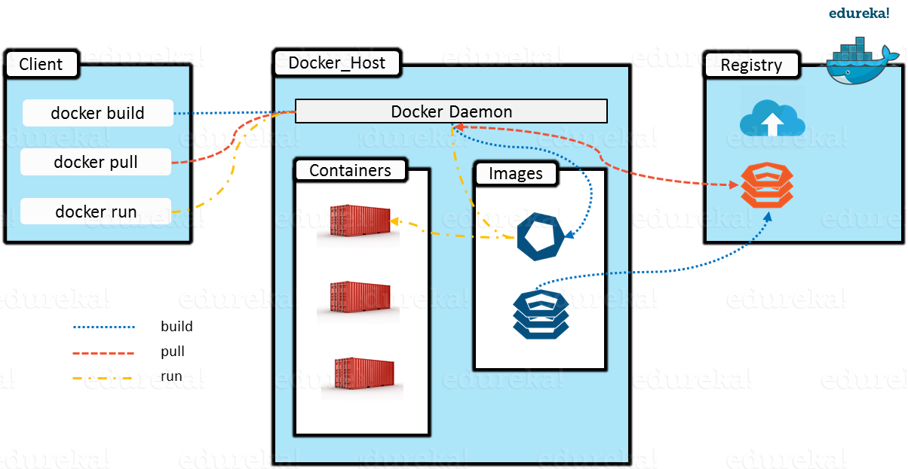

# Why,What and Wow! of Docker
```
To know about docker we must first know about containers.
To appreciate the beauty of containers, we must know about VMs.                                                  
 - some wise man.
 ```

 Imagine you require applications A,B,C on your server. But all these require different resources and OS versions.
 Now if we have a lot of space and money, we can have three different machines and run them separately. 
 But is there a better way?
 
###### Enter Virtual Machines.

You can now create VMs on a single server and run your apps on different VMs. Life's good.
But your VMs take a lot of time to boot up. You have different OS versions(each several GBs!) on top of hypervisor and hence your computer becomes slow.
 Life is not good now, but ok. But one day you are asked to move these applications to a public cloud. 
In addition to that you are supppsed to have not only 3 but 300 different types of applications(rather micro services) running. You are in a fix.

###### Enter containers.

You can now pack your application into these light weight conatiners (several 100 MBs) and move them easily.
You can have 100s of containers running on your original server.
You can make virtual machines using these containers. You can deploy once, use anywhere. Life has never been better!

###### DOCKER is a tool for production, management and porting of containers to put across in simple terms.


###### Docker architecture.

Your Docker Machine consists of three parts.

* Docker daemon(dockerd)
* Docker client(CLI)
* REST API



